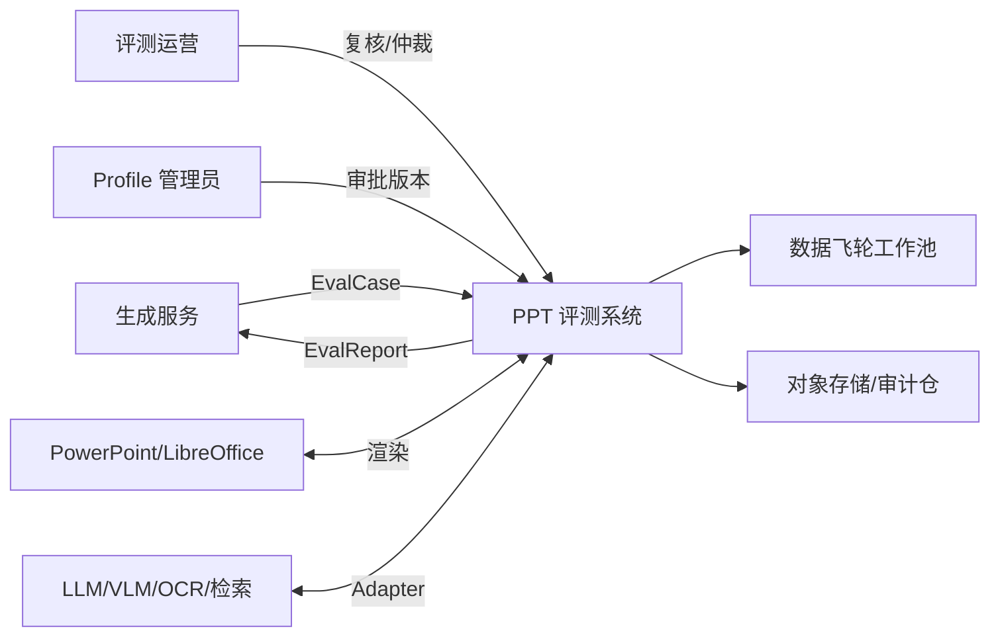
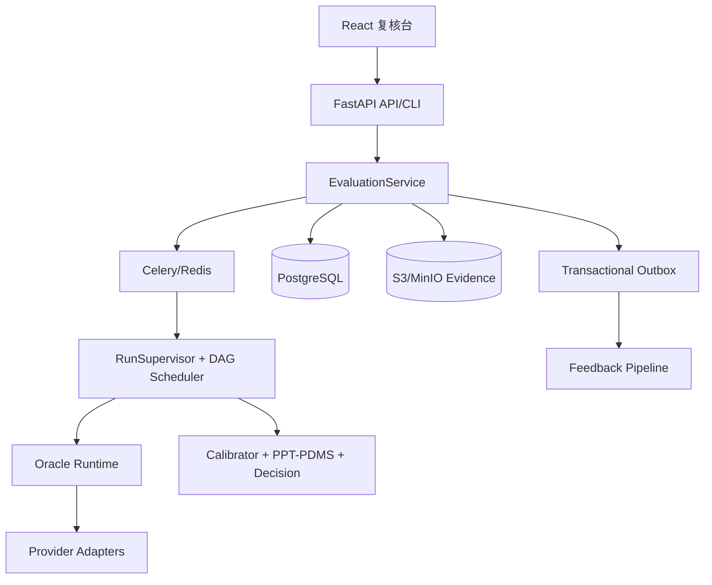
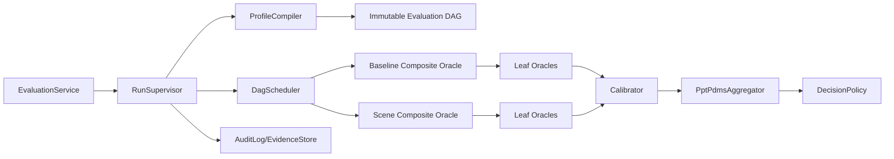
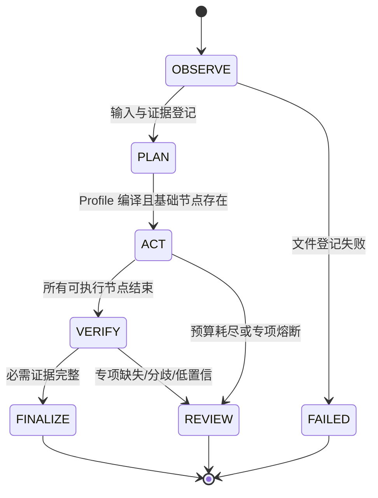
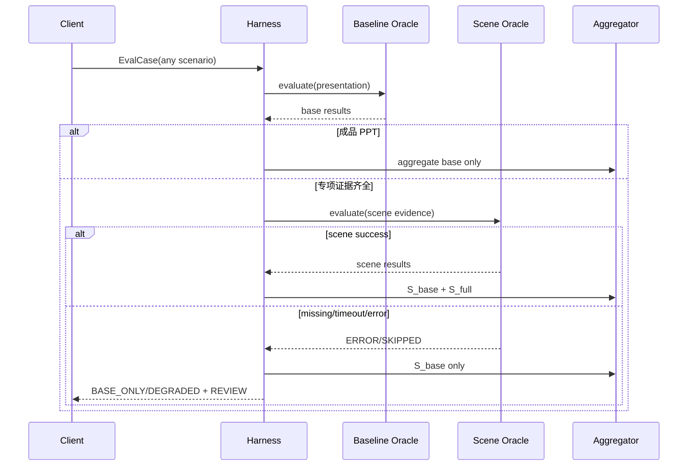
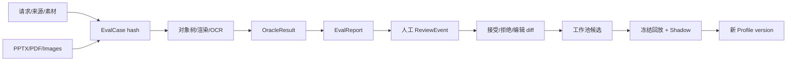
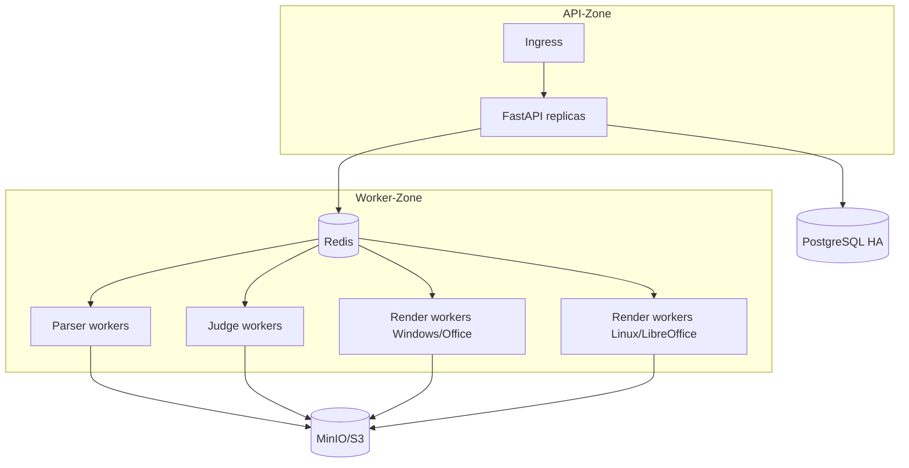

# 系统设计：Deterministic Agentic Harness

> 发布说明：本文中的 Redis/PostgreSQL/S3/多 worker 图是早期目标架构，不属于当前 main 的
> 单机运行时。当前有效 composition root 见 `07_single_node_release.md`；旧可执行骨架已归档到
> `archive/v8.3-pre-release`。

## 领域词汇

| 术语 | 定义 |
|---|---|
| Case | 一次评测请求及其证据引用 |
| Profile | 版本化指标、权重、乘子、预算与路由策略 |
| Oracle | 单一判断接口；Composite 组合但不聚合最终分 |
| Evidence | 可定位、可哈希、可访问控制的判断依据 |
| Harness | 编译 DAG、调度、验证、降级和结束的确定性总控 |
| Completeness | 评测证据完整程度，不等同质量分 |
| Decision | 业务门禁结论，与执行状态分离 |
| Run Manifest | 复现一次运行所需的完整版本指纹 |

## C4 Context

## C4 Container

## Component 与层级

层间规则：上层只依赖端口；Oracle 不决定全局调度或发布；聚合器不调用模型；DecisionPolicy
不修改分数；Adapter 不泄漏供应商类型到领域层。

## 设计模式

- Composite：场景/维度 Oracle 组合 Leaf Oracle。
- Strategy + Registry/Factory：Profile 选择指标、校准器和供应商实现。
- Command + DAG：每个节点是可重试、可审计命令。
- State：Supervisor 状态转换有显式守卫。
- Adapter：渲染器、LLM/VLM/OCR、检索和存储。
- Specification：`supports()`、证据充足性和门禁条件。
- Circuit Breaker/Bulkhead/Retry：隔离外部供应商故障；重试只针对瞬态错误。
- Transactional Outbox：报告写入与反馈事件原子提交。

## Harness 状态机

## 强制基础子图

`ProfileCompiler.compile(case, profile)` 先创建 `BaselinePptQualityOracle`，再合并场景节点。编译后执行
两个断言：基础节点唯一存在；任何 Scene 节点不得成为基础节点的前置依赖。DAG 序列化并哈希，
运行时不得动态添加模型建议节点。

## 四场景降级时序

文字场景证据是请求/受众；总结场景证据是来源版本；多模态场景证据是素材清单；成品场景不编译
Scene Oracle。四者共享上述降级骨架，仅 `supports()` 与 Profile 不同。

## 数据血缘

## 部署

渲染 Worker 与网络 Judge 分池；不可信 PPTX 在受限容器/虚拟机处理，默认禁出网。

## 质量属性场景

| 属性 | 刺激 | 响应 | 度量 |
|---|---|---|---|
| 降级 | Scene Judge 超时 | 输出基础分并 REVIEW | 100% 不丢本体报告 |
| 可替换 | 更换 VLM | 只改 Adapter/Profile | 领域与 API 契约无变化 |
| 安全 | PPTX 含宏/外链/炸弹 | 沙箱拒绝并留证 | 无执行、无外联 |
| 可追踪 | 审计员给 Run ID | 恢复所有版本和证据 | 关键字段 100% 完整 |
| 性能 | 20 页普通 PPTX | 快速层完成 | P95≤30s 目标 |
